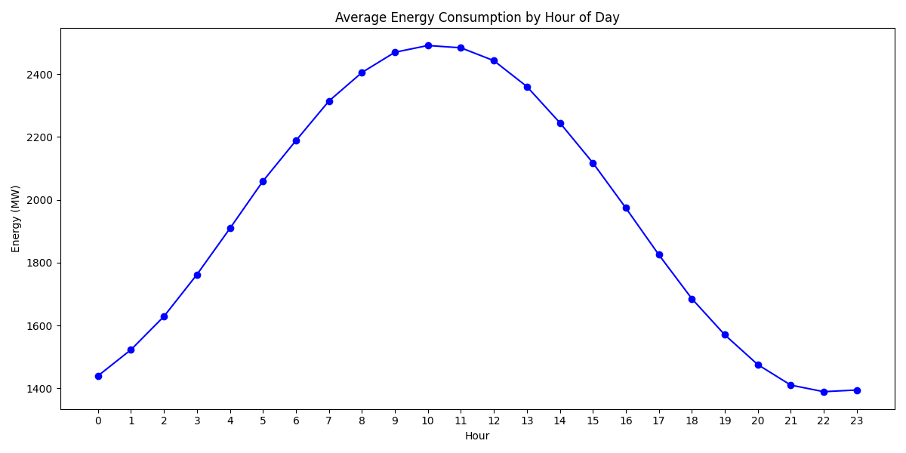
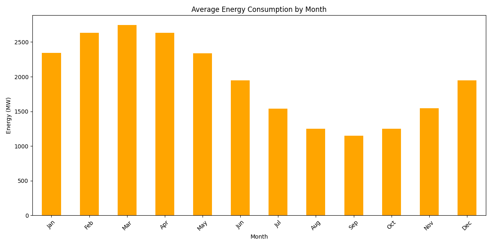
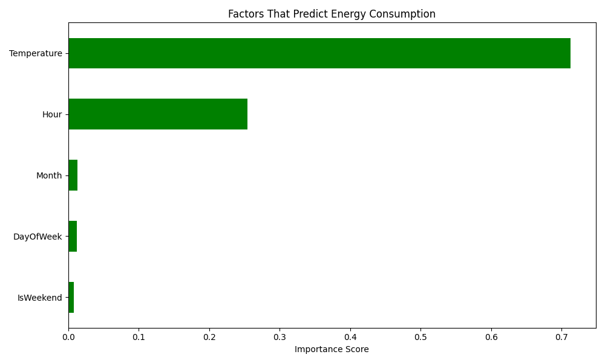
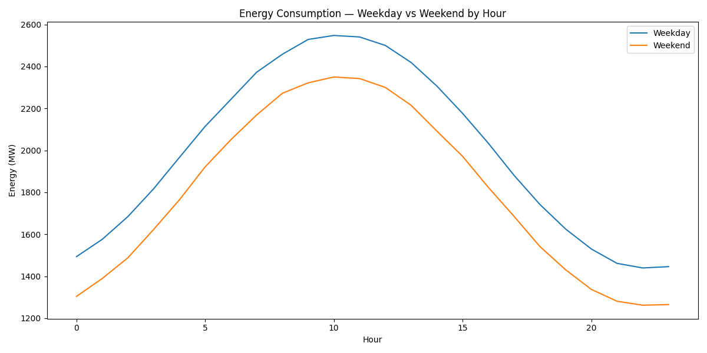

# Energy Consumption Predictor

A machine learning model that predicts hourly energy consumption with 97% accuracy using Random Forest — trained on 35,041 hourly readings across 4 years.

## Overview

India's energy demand is growing faster than supply. Without accurate forecasting, power companies cannot plan generation capacity — leading to blackouts, waste and inefficiency. This project builds a predictive model that forecasts energy consumption based on time, temperature and seasonal patterns.

## Results

| Metric | Value |
|--------|-------|
| Model accuracy | 97.38% |
| Mean Absolute Error | 90.74 MW |
| Total records | 35,041 hourly readings |
| Date range | 2020 to 2023 |
| Average consumption | 1,940.1 MW |
| Peak consumption | 3,813.4 MW |

## Key Findings

| Finding | Result |
|---------|--------|
| Peak hour | 10:00 AM |
| Off-peak hour | 10:00 PM |
| Peak month | March — summer begins |
| Lowest month | September — post monsoon |
| Weekend vs Weekday | Weekdays consume 200MW more |

## Charts

### Hourly Pattern

### Monthly Pattern

### Feature Importance

### Weekday vs Weekend

## How to Run

1. Clone the repository
   git clone https://github.com/Paddu2006/energy-consumption-predictor.git

2. Go into the folder
   cd energy-consumption-predictor

3. Install dependencies
   pip install pandas numpy scikit-learn matplotlib

4. Run the analysis
   python energy.py

## Tech Stack
Python, Pandas, NumPy, Scikit-learn, Random Forest, Matplotlib

## What I Learned
- How to engineer time-based features for forecasting
- How temperature and seasonality drive energy demand
- How Random Forest achieves 97% accuracy on time series data
- How energy forecasting supports grid planning and sustainability

## License
MIT License
